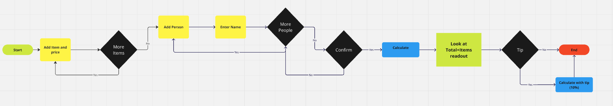
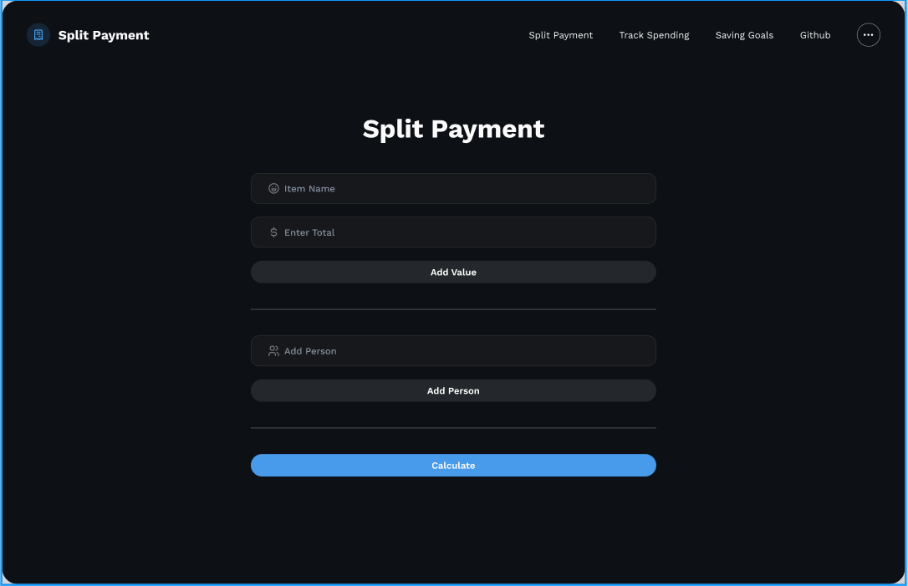
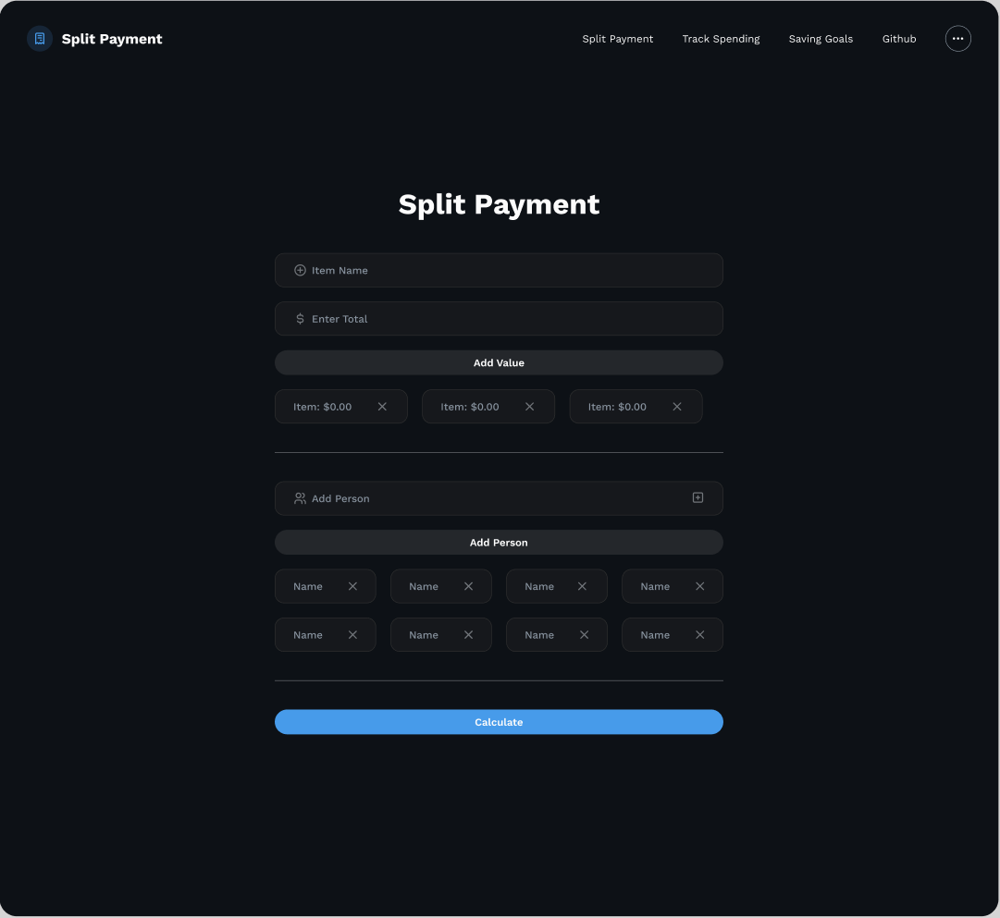
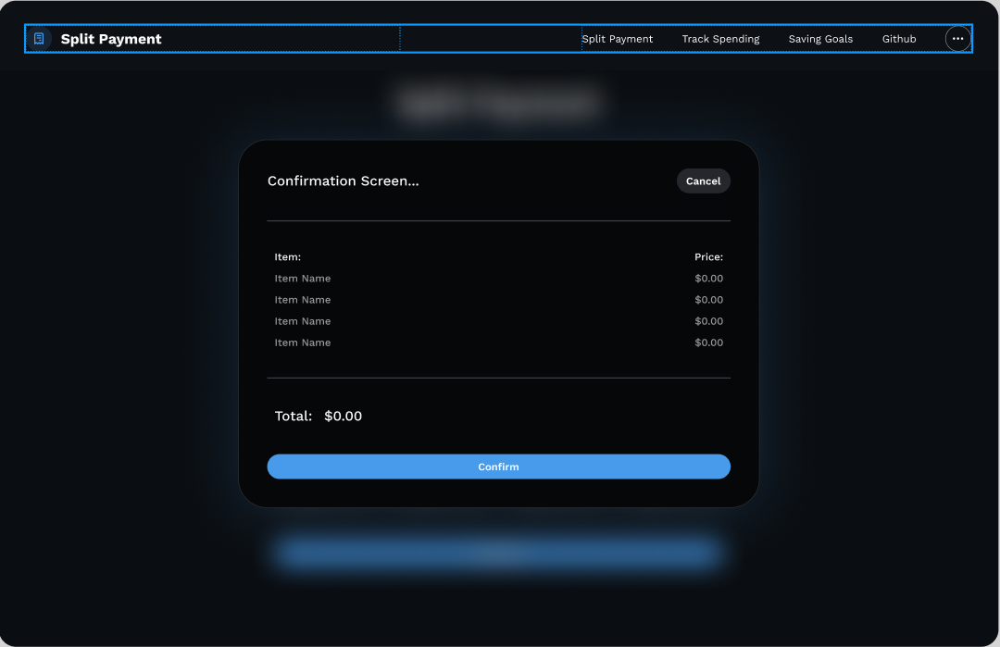
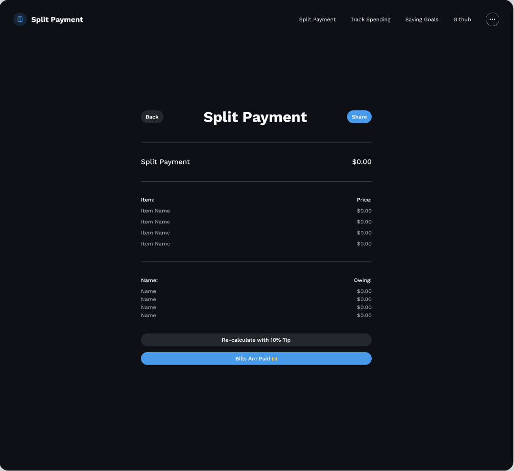

#Split Pay

##Description:
Splitting bills with friends can be a pain, especially when you have to factor in taxes and tips. 
Split Pay solves this problem by automating the calculations and ensuring everyone pays their fair share.
Working on this project improved our skills in designing apps that are easy to use and look good on any screen.
We learned how to make it responsive, handle user input effectively, and save data for a better experience.

##Table of Contents
- [Installation](#installation)
- [Usage](#usage)
- [Credits](#credits)
- [License](#license)
- [Screenshots](#screenshots)

##Installation
1. Open a web browser
2. Enter the following url into the browser's address bar
[Split Pay](https://debugbob.github.io/Split_Pay/)

##Usage
Upon loading the app, you’ll be presented with a form where you can input the names of items, the item prices, and participant names.
Add items and participants using the “Add Value” and “Add Person” buttons, respectively. These will populate underneath as cards.
Clicking a card's X button deletes the card.
Hover over buttons and cards to experience interactive color changes for enhanced user experience.
After adding all items and participants, click "Calculate" to get a confirmation modal with back and confirm buttons. The modal will display the itemized total , factoring in a 10% tip if required.
Clicking back closes the modal.
Clicking confirm takes you to a page to see total, list of items and prices, list of names and respective splits.

##Screenshots

##Credits
Robert Astorino
Mohamed Said
Pingbo Zhu
Shareef Evans

##License
- This project is not licensed.
- This project uses [Bootstrap](https://getbootstrap.com/), which is licensed under the [MIT License](https://github.com/twbs/bootstrap/blob/main/LICENSE).

##Features
Add unlimited items and participants to the bill.
Instant calculations, including a 10% tip.
Interactive and responsive user interface.
Data persistence using localStorage, so your entries are saved even after refreshing.